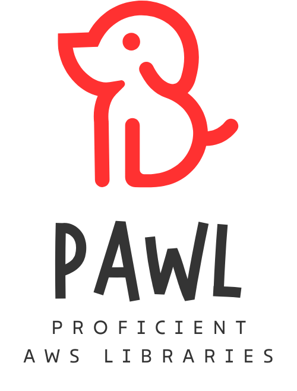
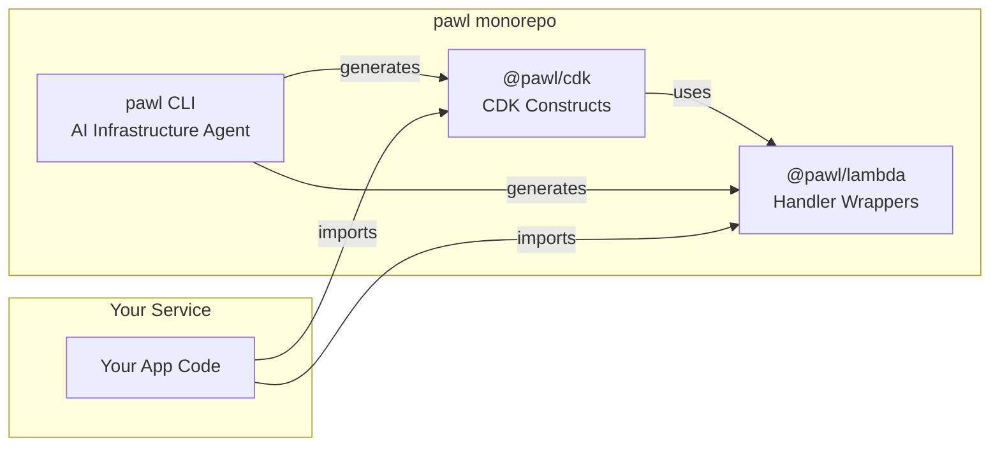

<div align="center">



Opinionated CDK constructs, Lambda handler wrappers, and an AI-powered infrastructure CLI.

[](https://github.com/jolo-dev/pawl/actions/workflows/ci.yml)
[](./LICENSE)
[](https://nodejs.org/)
[](https://bun.sh/)
[](https://www.typescriptlang.org/)
[](https://aws.amazon.com/cdk/)
[](./CONTRIBUTING.md)
[](https://localstack.cloud/)

</div>

---

pawl (pronounced *pɔːl*) is a TypeScript monorepo that provides building blocks for deploying AWS services correctly. Instead of wiring together `aws-cdk-lib`, Powertools, IAM policies, and compliance rules yourself, you use pawl's constructs and handlers — they include best practices by default.

## Why pawl?

Building AWS infrastructure with CDK means juggling dozens of packages, wiring up observability manually, remembering compliance rules, and repeating boilerplate across every project. pawl solves this:

| Problem | Without pawl | With pawl |
|---------|-------------|-----------|
| **Observability** | Manually configure Logger, Tracer, Metrics per Lambda | Automatic — every handler gets Powertools wired in |
| **Compliance** | Hope you remembered encryption, VPC, and IAM least-privilege | Constructs pass cdk-nag out of the box |
| **Consistency** | Different patterns across repos, different CDK versions | One library, one pattern, one version |
| **Boilerplate** | 50+ lines to set up a Lambda with proper IAM, alarms, tags | 5 lines — the construct handles the rest |
| **Type safety** | `any` creeping in, unvalidated events | Strict TypeScript + Zod, fully typed event handlers |

## Features

### 🏗️ Opinionated CDK Constructs

Every construct extends `BasicConstruct` which automatically applies:
- **Tagging** — Organizational tags propagated to all resources
- **IAM** — Least-privilege permissions with a declarative `grantPermission()` API
- **CloudFormation outputs** — Key ARNs and URLs exported automatically
- **Compliance** — All constructs pass [cdk-nag](https://github.com/cdklabs/cdk-nag) checks

Available constructs: `ApiGateway`, `LambdaFunction`, `EventBridge`, `Sqs`, `DynamoDbTableWithStreams`, `ApiDestination`, and more.

### ⚡ Battery-Included Lambda Handlers

Every handler created with `@pawl/lambda` automatically includes:
- **[Logger](https://docs.powertools.aws.dev/lambda/typescript/latest/core/logger/)** — Structured JSON logging with correlation IDs
- **[Tracer](https://docs.powertools.aws.dev/lambda/typescript/latest/core/tracer/)** — AWS X-Ray tracing with automatic segment capture
- **Hook system** — `addBeforeHook`, `addAfterHook`, `addErrorHook` for cross-cutting concerns
- **Type-safe events** — Each handler is typed to its event source (API Gateway, SQS, EventBridge, DynamoDB Streams, SNS)

```typescript
// That's it. Logger + Tracer + typed event — zero config.
export const handler = useApiHandler("my-service", async (event, logger) => {
  logger.info("Processing request", { path: event.rawPath });
  return { statusCode: 200, body: JSON.stringify({ ok: true }) };
});
```

### 📊 Monitoring & Observability

- **CloudWatch Alarms** — Constructs create alarms for error rates and latency
- **Structured Logging** — JSON logs with service name, correlation IDs, and cold start detection
- **Distributed Tracing** — X-Ray traces across Lambda → API Gateway → SQS → DynamoDB
- **Metrics** — Custom CloudWatch metrics via Powertools Metrics namespace

### 🤖 AI-Powered CLI

An interactive infrastructure agent powered by Amazon Bedrock that can:
- Generate CDK code from your codebase analysis
- Run AWS Well-Architected Framework reviews (all 6 pillars)
- Suggest cost optimizations
- Support multiple models (Anthropic, Amazon, Meta)

### 🧪 Local Development

Full local testing with [MiniStack](https://www.ministack.org/) (free, open-source AWS emulator):
- Deploy and test CDK stacks locally without AWS credentials
- Hot-reload Lambda functions via CDK hotswap
- Integration tests with Testcontainers

## Architecture



## Packages

| Package | Description |
|---------|-------------|
| [`@pawl/cdk`](./packages/cdk/) | Opinionated CDK constructs with built-in compliance, IAM, alarms, and tags |
| [`@pawl/lambda`](./packages/lambda/) | Typed Lambda handler wrappers with Powertools (Logger, Tracer, Metrics) |
| [`cli`](./packages/cli/) | AI-powered infrastructure CLI using Amazon Bedrock |

## Quick Start

### Prerequisites

- [Bun](https://bun.sh/) (latest)
- [Docker](https://www.docker.com/) (for local testing with MiniStack)
- Node.js 22+

### Installation

```bash
# Clone and install
git clone https://github.com/jolo-dev/pawl.git
cd pawl
bun install
```

### Build & Test

```bash
bun run build    # Build all packages
bun test         # Run all tests (requires Docker for integration tests)
```

### Lint & Format

```bash
bun run lint          # Check
bun run lint:fix      # Auto-fix
```

## Usage

### CDK Constructs

```typescript
import { ApiGateway, LambdaFunction } from "@pawl/cdk";

const fn = new LambdaFunction(stack, "Handler", {
  entry: "./src/handler.ts",
  serviceName: "my-service",
});

new ApiGateway(stack, "Api", {
  lambdaFunction: fn,
});
```

### Lambda Handlers

```typescript
import { useApiHandler } from "@pawl/lambda";

export const handler = useApiHandler("my-service", async (event, logger) => {
  logger.info("Request received");
  return {
    statusCode: 200,
    body: JSON.stringify({ message: "Hello World" }),
  };
});
```

### AI CLI

```bash
cd packages/cli
bun run index.ts
```

The CLI connects to Amazon Bedrock, lets you select a model, and provides an interactive agent that can generate infrastructure, run Well-Architected reviews, and optimize costs.

## Local Development

pawl uses [MiniStack](https://www.ministack.org/) for local AWS testing:

```bash
cd example/some-service
bunx cdk deploy --app "bunx tsx index.ts" --require-approval never
```

See the [example service](./example/some-service/) for a complete working setup.

## Documentation

Full documentation is available at the [pawl docs site](./docs/), built with Astro Starlight and auto-generated API references via TypeDoc.

```bash
cd docs
bun install
bun run dev    # http://localhost:4321
```

## AI Coding Agents

This repository is configured for use with AI coding agents. See [`AGENTS.md`](./AGENTS.md) for the cross-tool configuration and [`docs/AI_AGENTS.md`](./docs/AI_AGENTS.md) for workflow guidance.

Supported tools: GitHub Copilot, Cursor, Claude Code, Codex CLI, Windsurf, Kiro, and any tool that reads `AGENTS.md`.

## Contributing

See [CONTRIBUTING.md](./CONTRIBUTING.md) for development setup, coding standards, and how to submit changes.

## License

[MIT](./LICENSE)
