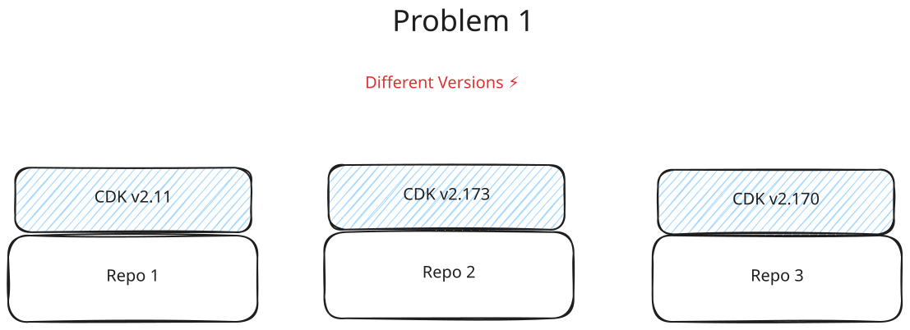
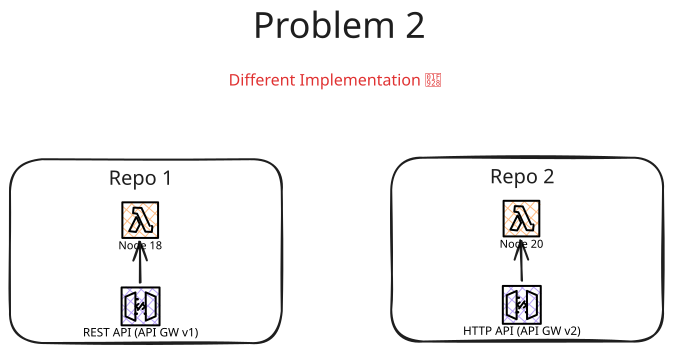

The HEMS AWS lib is a one stop shop that contains best practices of using AWS CDK, AWS Lambda, SAM templates.
The goal is that it is the only dependency and provides coding primitives which are company compliant when dealing with AWS.
Furthermore, it should simplify the infrastructure decision so that the developer can focus on logic implementation.

## Why do we need such a library?

Currently, we have multiple repositories. A problem could be to that we have different version for each repositories.

Another problem is the different ways to implement AWS Resources. For example, in one repository the older API GW is used whereas the another repo uses the newer version or different NodeJS versions are used.

The goal

