# CDK reference: missing pages and proposed diagrams

## Implementation status

The ownership-only ApiGateway pilot is now applied to all **22 existing Pawl-owned public class diagrams**. The pilot's ownership scope is retained; all class diagrams and adjacent explanations describe only provisioned/configured composition or actual helper state. Group headings name their resources rather than saying “Always created/provisioned”; optional-condition labels remain where useful. External callers, supplied targets, imported resource deployments, and shared stack monitoring were removed. Architecture-beta and the existing icon packs are preserved.

Source TypeDoc remains authoritative. References were regenerated with `rtk bun run --cwd docs build`, never hand-edited. Layout checks cover services, group boundaries, labels and viewport overflow, not just parser success. Conditional labels/prose replace unnecessary nested boxes where Mermaid's group bounds collided. Single-node non-provisioning errors need no fake self-edge.

The original inventory, third-party proposals, export-boundary findings, and earlier verification history below remain historical material; only Pawl-owned proposal diagrams and current status are synchronized. Lambda remains Node 24 and AgentCore Node 22; no runtime changes are part of this rollout.

### Current ownership and condition inventory

Nodes are logical summaries of provisioning/configuration responsibility, not necessarily direct CDK children or standalone CloudFormation resources. Undirected edges express configuration; diagrams do not promise all conditional branches coexist. Supporting IAM and nested inventory remain in prose rather than duplicating supplied targets.

| Class and source | Exact primary node IDs | Ownership and conditions |
| --- | --- | --- |
| [AgentCore](../../packages/cdk/src/agentcore.ts#L52) | `asset`, `runtime`, `endpoint` | Always asset, Node 22 HTTP runtime, and endpoint including DEFAULT. Runtime role may be supplied. No model/VPC/shared monitoring node. |
| [ApiDestination](../../packages/cdk/src/api-destination.ts#L41) | `connection`, `destination` | Always destination and authentication connection, provisioned in supplied scope. Endpoint/method are configuration, not services. |
| [ApiGateway](../../packages/cdk/src/apigateway.ts#L88) | `logs`, `api`, `routes`, `authorizer` | Preserved pilot: API/stage and logs always; routes when configured; API authorizer only when bound JWT/Cognito/Lambda auth needs one. Supplied functions, buses and user pools omitted. |
| [ApiGatewayV1](../../packages/cdk/src/apigateway-v1.ts#L67) | `logs`, `api`, `routes` | Always REST API/prod stage and log group. Route resources/methods/integrations only when configured; access-log wiring and CloudWatch role only outside LOCAL. No supplied authorizer/function node. |
| [AuthoritativeRevisionArbitrationExhaustedError](../../packages/cdk/src/reviewer/pipeline-review-common.ts#L245) | `error` | One contained software error node: fixed name/message and retryable=true, no arbitration/state store/retry scheduling. |
| [CodeBuildProject](../../packages/cdk/src/codebuild-project.ts#L283) | `placeholder`, `build`, `logs`, `key`, `security` | Always project, log group, rotating key and placeholder bucket in both source modes. Placeholder source used only in pipeline mode. HTTPS-egress SG only for private network; imported VPC and external registry/repository omitted. |
| [CodeCommit](../../packages/cdk/src/codecommit.ts#L309) | `repo`, `seed`, `events`, `reviewer` | All nodes conditional. Repository only in create mode; seed only create.sourcePath. Router-mode events/DLQ and autoReview composition are mutually exclusive. Import without review options creates no resources; no duplicate reviewer events or bootstrap bucket. |
| [CodeCommitAutoReviewer](../../packages/cdk/src/codecommit-auto-reviewer.ts#L431) | `events`, `dlq`, `checks`, `router`, `reviewer`, `state`, `bridge`, `reconciler`, `schedule` | Always shared router, durable reviewer/version/alias and table; per-repository rules/bindings, DLQ and nested checks project. Only active phase adds bridge/reconciler/schedule. GSI1 any coordination phase; GSI2 except prepareGsi1. No model, repo or external pipeline. |
| [CodeCommitReviewEvents](../../packages/cdk/src/codecommit-review-events.ts#L93) | `pr`, `comments`, `target`, `dlq`, `fallback` | Always native PR/comment rules, Lambda delivery bindings and encrypted DLQ. CloudTrail fallback rule only when enabled; supplied/imported repo, supplied router and external trail omitted. |
| [CodeCommitSourceLimitError](../../packages/cdk/src/codecommit-source.ts#L117) | `error`, `metadata` | Only Error name/message and kind/limit/actual/optional relativePath state. reason only customizes message; no validators, file contents or AWS deployment. |
| [CodePipeline](../../packages/cdk/src/codepipeline.ts#L322) | `pipeline`, `source`, `actions`, `repo`, `seed`, `storage`, `key`, `pr`, `reviewer`, `execution`, `aiReview` | V2 pipeline constructor; source action and >=1 user stage required for valid synth. Repository only create source, seed only sourcePath. Bucket only absent artifactBucket/crossRegionReplicationBuckets; key only additionally absent artifactEncryptionKey. PR-without-reviewer composition includes execution rule; alternative autoReviewer reuses router and adds separate execution rule only in PR mode. AIReview only active PR coordination, alongside first-stage actions. Subsequent stages optional; targets supplied/reused. |
| [DurableLambdaFunction](../../packages/cdk/src/durable-lambda-function.ts#L47) | `lambda`, `version`, `alias` | Always durable-configured inherited Lambda, published version and alias. Inherited bundle/monitoring summarized in prose. Explicit grants differ; callback helper creates a policy. No separate durable-state storage. |
| [DynamoDbTable](../../packages/cdk/src/dynamodb-table.ts#L142) | `table`, `indexes` | Always on-demand Dynamo-owned-encrypted table; indexes only when supplied and are table configuration. PITR/retain default on, TTL optional. Consumers require grants. |
| [DynamoDbTableWithStreams](../../packages/cdk/src/dynamodb-streams.ts#L67) | `table`, `mapping` | Always new TableV2 with required stream and configured mapping on supplied Lambda. existingTable is unused, not import support. retain only for removalPolicy=retain; otherwise destroy. |
| [EventBridge](../../packages/cdk/src/eventbridge.ts#L98) | `dlq`, `bus`, `rules`, `pipe` | Always bus and DLQ. Rules/bindings only for supported configured targets/createRule; API destination requires secrets; empty targets has no rules. Pipe only for source/targetEventBus configuration, independent of this bus. DLQ attached to bus/Lambda delivery only. |
| [LambdaFunction](../../packages/cdk/src/lambda-function.ts#L48) | `bundle`, `lambda` | Always ESM packaging and Node 24 ARM64 function. Role may be supplied; authorizer is just a flag; stack monitoring not owned. |
| [LocalStack](../../packages/cdk/src/local-stack.ts#L32) | `lambda`, `url`, `outputs` | Function, URL and output per directory entry, zero for empty directory. No TS filtering, Docker, App or implicit LOCAL activation; inherits Stack monitoring mode. |
| [PipelineDefinitionError](../../packages/cdk/src/pipeline/errors.ts#L31) | `error`, `details` | Only code, optional path, Error name/message. No validation implementation or caller. |
| [PipelineReviewDispatcher](../../packages/cdk/src/reviewer/pipeline-review-common.ts#L284) | `arbitration`, `dispatch`, `mapping`, `terminal`, `coordination` | Non-provisioning implementation responsibilities. Uses injected store/transport/reconciler/clock references, not owned AWS targets. Four-attempt arbitration and replay path; mapping/terminal persistence independent of optional review-job coordination (default true). Reconciler reference required even disabled. |
| [Sqs](../../packages/cdk/src/sqs.ts#L40) | `queue`, `dlq`, `mapping` | Always queue, one-day DLQ and batch-10 mapping bound to supplied consumer. retry controls redrive; FIFO optional. Permissions part of binding; no automatic monitoring call. |
| [Stack](../../packages/cdk/src/stack.ts#L30) | `stack`, `monitoring`, `noop` | Stack is assembly root. Outside LOCAL: MonitoringFacade; truthy LOCAL: shared recursive no-op proxy instead. Does not instantiate generic application constructs. |
| [StaticSite](../../packages/cdk/src/static-site.ts#L97) | `headers`, `cdn`, `site`, `logs` | Always distribution/OAC, private versioned bucket, retained log bucket and security response policy. SPA fallback is distribution configuration. Optional Cognito identifiers are state only; no viewer auth or asset deployment. |

### Current validation evidence

Current checks: **51 focused tests pass; full suite 1,081 pass / 8 existing live-AWS skips / 0 fail; lint clean (297 files); docs build 183 pages**. Headless browser verification covers **88 views** (all 22 pages, dark/light, desktop/mobile), with no parser errors, node/group/label-box collisions, huge canvases, or page overflow. That original checker did not compare connectors with labels; its zero failures did not establish collision-free routes. The connector review and refreshed evidence below supersede that limitation. All 78 source ASTs and 11 protected snapshot files match the before-state; the approved pilot is byte-identical. Exact commands/log paths and the remaining independent review gate are recorded in [the implementation plan](../superpowers/plans/2026-09-08-contained-construct-diagrams.md). The verification history at the end of this audit predates this rollout.

## Original audit scope and results

Audited the class exports reachable through `packages/cdk/index.ts` using the TypeScript compiler API, compared them with `docs/src/content/docs/cdk/classes/*.md`, and inspected the local implementations. This includes aliases and third-party re-exports, not every internal class under `src/`.

| Category | Exported classes | Existing pages | Existing diagrams | Missing pages | Missing diagrams |
| --- | ---: | ---: | ---: | ---: | ---: |
| Pawl infrastructure and composition | 18 | 8 | 5 | 10 | 13 |
| Pawl runtime helpers and errors | 4 | 0 | 0 | 4 | 4 |
| Third-party re-exports | 17 | 10 | 0 | 7 | 17 |
| **Total** | **39** | **18** | **5** | **21** | **34** |

The five existing diagrams belong to `ApiGateway`, `DynamoDbTableWithStreams`, `EventBridge`, `LambdaFunction`, and `Sqs`. Four need corrections described below.

### How generation actually works

The pages are generated from **TypeScript exports and JSDoc**, not from the diagrams themselves. `docs/astro.config.ts` gives TypeDoc `../packages/cdk/index.ts` as its entry point. `docs/typedoc-plugin-mermaid.mjs` transforms Mermaid fences in comments into diagram markup.

There are consequently two separate problems:

1. The checked-in reference is behind the current public API: 21 exported classes have no page.
2. Source documentation is sparse: only five local classes contain Mermaid fences. Regenerating pages alone will not add the missing diagrams.

**Do not hand-edit generated class pages.** Add diagrams to local class JSDoc, then regenerate using the docs build. For third-party classes, use hand-authored integration guides or a deliberate TypeDoc comment-enrichment mechanism; do not modify `node_modules`.

There is also a comment-placement issue: the long public `CodeCommit` description currently immediately precedes the private `ExistingSourceAssetCode` helper, rather than `export class CodeCommit`. Move that description to the public class when implementing documentation changes.

### Diagram approach

Use Mermaid **`architecture-beta` exclusively**, matching the TypeDoc example in `packages/cdk/src/apigateway.ts`: icon-bearing services, groups, and directional port connections. AWS icons use the existing `logos` pack; generic software components use Mermaid built-in icons. Optional behavior belongs in group labels and accompanying prose, not unsupported edge labels or dashed connections. Mermaid `align row` and `align column` directives keep parallel services separated without changing their relationships.

These are **proposed documentation diagrams**, not infrastructure changes. Arrows show interaction direction; undirected lines show configuration or supporting relationships. Groups identify components, conditional resources, or software boundaries, not necessarily deployed AWS resources. External references are not provisioned by the class. For runtime helpers, errors, and value objects, diagrams show component relationships rather than execution timelines. Diagrams are intentionally conceptual rather than exhaustive CloudFormation inventories.

Every connection references a declared service. Where an edge connects to a group boundary, it uses a member service with `{group}`, never the group ID itself.

## A. Pawl infrastructure: 13 missing diagrams

### AgentCore

Source: [agentcore.ts](../../packages/cdk/src/agentcore.ts#L52). **Current ownership-only diagram.**

Always asset, Node 22 HTTP runtime, and endpoint including DEFAULT. Runtime role may be supplied. No model/VPC/shared monitoring node.

```mermaid
architecture-beta
  group agent(cloud)[AgentCore runtime]
  service asset(disk)[Code asset] in agent
  service runtime(logos:nodejs-icon)[HTTP runtime Node 22] in agent
  service endpoint(cloud)[Runtime endpoint] in agent
  asset:R --> L:runtime
  runtime:R -- L:endpoint
```

### ApiDestination

Source: [api-destination.ts](../../packages/cdk/src/api-destination.ts#L41). **Current ownership-only diagram.**

Always destination and authentication connection, provisioned in supplied scope. Endpoint/method are configuration, not services.

```mermaid
architecture-beta
  group destinationGroup(logos:aws-eventbridge)[API destination]
  service connection(logos:aws-iam)[Connection authentication] in destinationGroup
  service destination(logos:aws-eventbridge)[API destination] in destinationGroup
  connection:R -- L:destination
```

### ApiGatewayV1

Source: [apigateway-v1.ts](../../packages/cdk/src/apigateway-v1.ts#L67). **Current ownership-only diagram.**

Always REST API/prod stage and log group. Route resources/methods/integrations only when configured; access-log wiring and CloudWatch role only outside LOCAL. No supplied authorizer/function node.

```mermaid
architecture-beta
  group routing(logos:aws-api-gateway)[When routes are set]
  service logs(logos:aws-cloudwatch)[Access log group]
  service api(logos:aws-api-gateway)[REST API and prod stage]
  service routes(logos:aws-api-gateway)[Routes and integrations] in routing
  logs:R -- L:api
  api:R -- L:routes{group}
```

### CodeBuildProject

Source: [codebuild-project.ts](../../packages/cdk/src/codebuild-project.ts#L283). **Current ownership-only diagram.**

Always project, log group, rotating key and placeholder bucket in both source modes. Placeholder source used only in pipeline mode. HTTPS-egress SG only for private network; imported VPC and external registry/repository omitted.


### CodeCommit

Source: [codecommit.ts](../../packages/cdk/src/codecommit.ts#L309). **Current ownership-only diagram.**

All nodes conditional. Repository only in create mode; seed only create.sourcePath. Router-mode events/DLQ and autoReview composition are mutually exclusive. Import without review options creates no resources; no duplicate reviewer events or bootstrap bucket.

```mermaid
architecture-beta
  group composition(logos:aws-codecommit)[All components conditional]
  service repo(logos:aws-codecommit)[Repository in create mode] in composition
  service seed(disk)[Seed with sourcePath] in composition
  service events(logos:aws-eventbridge)[Router mode rules and DLQ] in composition
  service reviewer(cloud)[AutoReview resources] in composition
  seed:R --> L:repo
  repo:R -- L:events
  repo:T -- L:reviewer
```

### CodeCommitAutoReviewer

Source: [codecommit-auto-reviewer.ts](../../packages/cdk/src/codecommit-auto-reviewer.ts#L431). **Current ownership-only diagram.**

Always shared router, durable reviewer/version/alias and table; per-repository rules/bindings, DLQ and nested checks project. Only active phase adds bridge/reconciler/schedule. GSI1 any coordination phase; GSI2 except prepareGsi1. No model, repo or external pipeline.


### CodeCommitReviewEvents

Source: [codecommit-review-events.ts](../../packages/cdk/src/codecommit-review-events.ts#L93). **Current ownership-only diagram.**

Always native PR/comment rules, Lambda delivery bindings and encrypted DLQ. CloudTrail fallback rule only when enabled; supplied/imported repo, supplied router and external trail omitted.


### CodePipeline

Source: [codepipeline.ts](../../packages/cdk/src/codepipeline.ts#L322). **Current ownership-only diagram.**

V2 pipeline constructor; source action and >=1 user stage required for valid synth. Repository only create source, seed only sourcePath. Bucket only absent artifactBucket/crossRegionReplicationBuckets; key only additionally absent artifactEncryptionKey. PR-without-reviewer composition includes execution rule; alternative autoReviewer reuses router and adds separate execution rule only in PR mode. AIReview only active PR coordination, alongside first-stage actions. Subsequent stages optional; targets supplied/reused.

```mermaid
architecture-beta
  group composition(logos:aws-codepipeline)[Configured composition]
  service pipeline(logos:aws-codepipeline)[V2 pipeline] in composition
  service source(logos:aws-codecommit)[CodeCommit source action] in composition
  service actions(logos:aws-codepipeline)[Configured stages and actions] in composition
  service repo(logos:aws-codecommit)[Optional created repository] in composition
  service seed(disk)[Optional initial source ZIP asset] in composition
  service storage(logos:aws-s3)[Optional artifact bucket] in composition
  service key(logos:aws-kms)[Optional created key] in composition
  service pr(logos:aws-lambda)[PR routing without reviewer] in composition
  service reviewer(cloud)[Optional autoReviewer] in composition
  service execution(logos:aws-eventbridge)[Execution rule only in PR mode] in composition
  service aiReview(logos:aws-lambda)[AIReview only active PR mode] in composition
  seed:R --> L:repo
  repo:R -- L:source
  pipeline:T -- R:source
  pipeline:T -- L:actions
  storage:R -- L:pipeline
  storage:L -- R:key
  pr:L -- R:pipeline
  aiReview:L -- R:actions
  aiReview:R -- L:reviewer
  reviewer:R -- L:execution
```

### DurableLambdaFunction

Source: [durable-lambda-function.ts](../../packages/cdk/src/durable-lambda-function.ts#L47). **Current ownership-only diagram.**

Always durable-configured inherited Lambda, published version and alias. Inherited bundle/monitoring summarized in prose. Explicit grants differ; callback helper creates a policy. No separate durable-state storage.

```mermaid
architecture-beta
  group functionGroup(logos:aws-lambda)[Durable Lambda function]
  service lambda(logos:aws-lambda)[Durable Node 24 Lambda] in functionGroup
  service version(logos:aws-lambda)[Published function version] in functionGroup
  service alias(logos:aws-lambda)[Durable alias] in functionGroup
  lambda:R -- L:version
  version:R -- L:alias
```

### DynamoDbTable

Source: [dynamodb-table.ts](../../packages/cdk/src/dynamodb-table.ts#L142). **Current ownership-only diagram.**

Always on-demand Dynamo-owned-encrypted table; indexes only when supplied and are table configuration. PITR/retain default on, TTL optional. Consumers require grants.

```mermaid
architecture-beta
  group tableGroup(logos:aws-dynamodb)[DynamoDB table]
  group optionalIndexes(database)[When indexes are configured]
  service table(logos:aws-dynamodb)[On demand table] in tableGroup
  service indexes(database)[Global secondary indexes] in optionalIndexes
  table:R -- L:indexes
```

### LocalStack

Source: [local-stack.ts](../../packages/cdk/src/local-stack.ts#L32). **Current ownership-only diagram.**

Function, URL and output per directory entry, zero for empty directory. No TS filtering, Docker, App or implicit LOCAL activation; inherits Stack monitoring mode.

```mermaid
architecture-beta
  group entryGroup(logos:aws-lambda)[Per directory entry]
  service lambda(logos:aws-lambda)[Node 24 LambdaFunction] in entryGroup
  service url(internet)[Function URL] in entryGroup
  service outputs(logos:aws-cloudformation)[URL output] in entryGroup
  lambda:R -- L:url
  url:R -- L:outputs
```

### Stack

Source: [stack.ts](../../packages/cdk/src/stack.ts#L30). **Current ownership-only diagram.**

Stack is assembly root. Outside LOCAL: MonitoringFacade; truthy LOCAL: shared recursive no-op proxy instead. Does not instantiate generic application constructs.

```mermaid
architecture-beta
  group stackGroup(logos:aws-cloudformation)[Assembly root]
  group cloudMode(logos:aws-cloudwatch)[Outside LOCAL]
  group localMode(server)[LOCAL truthy]
  service stack(logos:aws-cloudformation)[CDK stack] in stackGroup
  service monitoring(logos:aws-cloudwatch)[MonitoringFacade] in cloudMode
  service noop(server)[No op monitoring] in localMode
  stack:R -- L:monitoring
  stack:L -- R:noop
```

### StaticSite

Source: [static-site.ts](../../packages/cdk/src/static-site.ts#L97). **Current ownership-only diagram.**

Always distribution/OAC, private versioned bucket, retained log bucket and security response policy. SPA fallback is distribution configuration. Optional Cognito identifiers are state only; no viewer auth or asset deployment.


## B. Pawl runtime helpers and errors: 4 missing diagrams

All four classes also have missing generated pages. These are exported runtime/validation APIs, not AWS resource constructs. Their diagrams should explain behavior rather than invent infrastructure.

### PipelineReviewDispatcher

Source: [pipeline-review-common.ts](../../packages/cdk/src/reviewer/pipeline-review-common.ts#L284). **Current ownership-only diagram.**

Non-provisioning implementation responsibilities. Uses injected store/transport/reconciler/clock references, not owned AWS targets. Four-attempt arbitration and replay path; mapping/terminal persistence independent of optional review-job coordination (default true). Reconciler reference required even disabled.


### PipelineDefinitionError

Source: [errors.ts](../../packages/cdk/src/pipeline/errors.ts#L31). **Current ownership-only diagram.**

Only code, optional path, Error name/message. No validation implementation or caller.

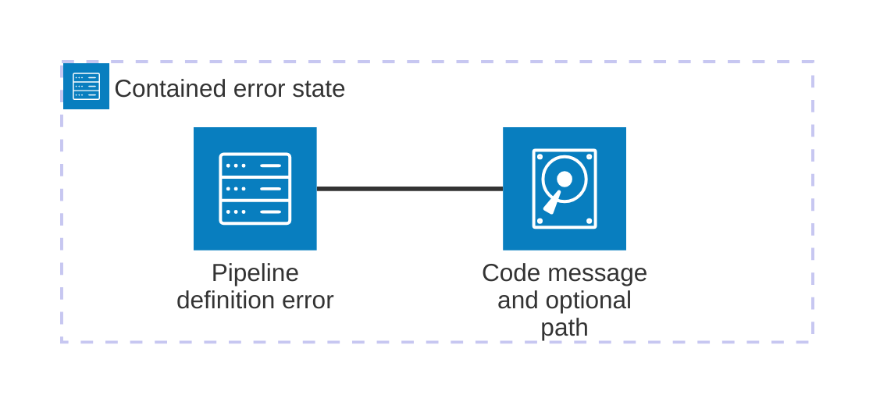

### CodeCommitSourceLimitError

Source: [codecommit-source.ts](../../packages/cdk/src/codecommit-source.ts#L117). **Current ownership-only diagram.**

Only Error name/message and kind/limit/actual/optional relativePath state. reason only customizes message; no validators, file contents or AWS deployment.

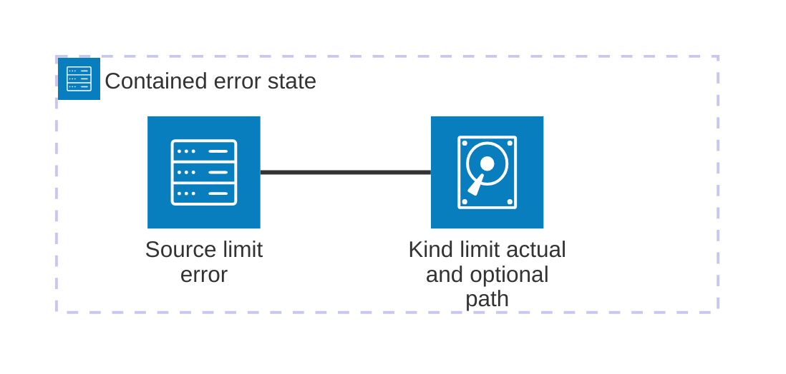

### AuthoritativeRevisionArbitrationExhaustedError

Source: [pipeline-review-common.ts](../../packages/cdk/src/reviewer/pipeline-review-common.ts#L245). **Current ownership-only diagram.**

One contained software error node: fixed name/message and retryable=true, no arbitration/state store/retry scheduling.

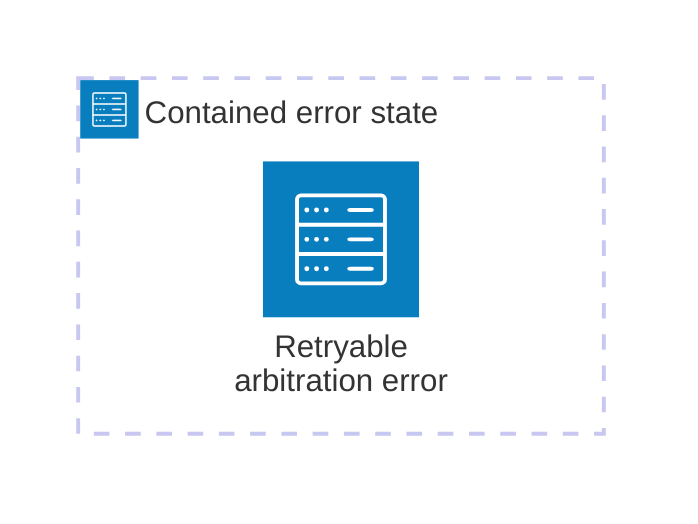

## C. Third-party re-exports: 17 missing diagrams

These exports legitimately appear as classes, but Pawl does not own their declarations. Recommend linking to upstream API documentation and placing the following conceptual diagrams in integration guides rather than duplicating every upstream class page.

Seven pages are missing: `App`, `Artifact`, `BuildSpec`, `CfnOutput`, `Duration`, `HttpNoneAuthorizer`, and `Template`. The other ten pages exist without diagrams.

### App

Re-export: `packages/cdk/index.ts`; upstream `aws-cdk-lib`. **Page missing.**

```mermaid
architecture-beta
  group application(server)[CDK application software]
  service app(server)[App] in application
  service stacks(logos:aws-cloudformation)[Stacks and construct trees] in application
  service assembly(disk)[Synthesized cloud assembly]
  app:R -- L:stacks
  stacks:R --> L:assembly
```

### Artifact

Re-export: `packages/cdk/index.ts`; upstream `aws-codepipeline`. **Page missing.**

```mermaid
architecture-beta
  group pipeline(logos:aws-codepipeline)[Pipeline artifact integration]
  service producer(server)[Producing action] in pipeline
  service artifact(disk)[Named Artifact] in pipeline
  service consumer(server)[Consuming action] in pipeline
  service bucket(logos:aws-s3)[Pipeline artifact bucket]
  producer:R --> L:artifact
  artifact:R --> L:consumer
  artifact:B -- T:bucket
```

### Authorization

Re-export: `packages/cdk/src/api-destination.ts`; upstream `aws-events`. **Page exists.**

```mermaid
architecture-beta
  group events(logos:aws-eventbridge)[EventBridge authorization integration]
  service auth(logos:aws-iam)[Basic API key or OAuth settings]
  service connection(logos:aws-eventbridge)[Connection] in events
  service destination(logos:aws-eventbridge)[API destination] in events
  service endpoint(internet)[External authenticated API]
  auth:R -- L:connection
  connection:R -- L:destination
  destination:R --> L:endpoint
```

### BuildSpec

Re-export: `packages/cdk/index.ts`; upstream `aws-codebuild`. **Page missing.**

```mermaid
architecture-beta
  group configuration(server)[Build configuration software]
  service input(disk)[Object file or source reference] in configuration
  service spec(server)[BuildSpec] in configuration
  service project(logos:aws-codebuild)[CodeBuild project]
  service commands(server)[Configured build commands]
  input:R -- L:spec
  spec:R -- L:project
  project:R --> L:commands
```

### CfnOutput

Re-export: `packages/cdk/index.ts`; upstream `aws-cdk-lib`. **Page missing.**

```mermaid
architecture-beta
  group stackGroup(logos:aws-cloudformation)[Stack output declaration]
  service value(server)[Resource attribute or value] in stackGroup
  service output(server)[CfnOutput] in stackGroup
  service template(disk)[CloudFormation Outputs]
  service consumer(server)[Operator or importing stack]
  value:R -- L:output
  output:R --> L:template
  template:R --> L:consumer
```

### Construct

Re-export: `packages/cdk/index.ts` and `src/stack.ts`; upstream `constructs`. **Page exists.**

```mermaid
architecture-beta
  group tree(server)[Construct tree software]
  service scope(server)[Parent scope] in tree
  service construct(server)[Construct node] in tree
  service childA(server)[Child construct A] in tree
  service childB(server)[Child construct B] in tree
  scope:B -- T:construct
  construct:L -- R:childA
  construct:R -- L:childB
```

### Duration

Re-export: `packages/cdk/index.ts`; upstream `aws-cdk-lib`. **Page missing.**

```mermaid
architecture-beta
  group configuration(server)[CDK configuration software]
  service value(disk)[Number and time unit] in configuration
  service duration(server)[Duration value object] in configuration
  service property(server)[Timeout interval or retention property] in configuration
  value:R -- L:duration
  duration:R -- L:property
```

This is configuration, not a deployed resource.

### HttpIamAuthorizer

Re-export: `packages/cdk/src/apigateway.ts`; upstream `aws-apigatewayv2-authorizers`. **Page exists.**

```mermaid
architecture-beta
  group gateway(logos:aws-api-gateway)[HTTP API with IAM authorization]
  service client(internet)[SigV4 signed client]
  service api(logos:aws-api-gateway)[HTTP API route] in gateway
  service auth(logos:aws-iam)[HttpIamAuthorizer] in gateway
  service integration(server)[Authorized integration]
  client:R --> L:api
  auth:B -- T:api
  api:R --> L:integration
```

### HttpJwtAuthorizer

Re-export: `packages/cdk/src/apigateway.ts`; upstream `aws-apigatewayv2-authorizers`. **Page exists.**

```mermaid
architecture-beta
  group gateway(logos:aws-api-gateway)[HTTP API with JWT authorization]
  service client(internet)[Bearer JWT client]
  service api(logos:aws-api-gateway)[HTTP API route] in gateway
  service auth(logos:jwt)[HttpJwtAuthorizer] in gateway
  service config(server)[Issuer audience and scope settings]
  service integration(server)[Authorized integration]
  client:R --> L:api
  config:R -- L:auth
  auth:B -- T:api
  api:R --> L:integration
```

### HttpLambdaAuthorizer

Re-export: `packages/cdk/src/apigateway.ts`; upstream `aws-apigatewayv2-authorizers`. **Page exists.**

```mermaid
architecture-beta
  group gateway(logos:aws-api-gateway)[HTTP API with Lambda authorization]
  service client(internet)[Client]
  service api(logos:aws-api-gateway)[HTTP API route] in gateway
  service config(server)[HttpLambdaAuthorizer configuration] in gateway
  service auth(logos:aws-lambda)[Supplied authorizer Lambda]
  service integration(server)[Authorized integration]
  client:R --> L:api
  config:R -- L:api
  api:T <--> B:auth
  api:R --> L:integration
```

Caching can avoid a Lambda invocation; the diagram does not promise invocation on every request.

### HttpNoneAuthorizer

Re-export: `packages/cdk/src/apigateway.ts`; upstream `aws-apigatewayv2`. **Page missing.**

```mermaid
architecture-beta
  group gateway(logos:aws-api-gateway)[HTTP API without route authorization]
  service client(internet)[Client]
  service route(logos:aws-api-gateway)[HTTP API route] in gateway
  service config(server)[HttpNoneAuthorizer configuration] in gateway
  service integration(server)[Configured integration]
  client:R --> L:route
  config:B -- T:route
  route:R --> L:integration
```

This explicitly disables route authorization; other application or network controls are outside its scope.

### HttpUserPoolAuthorizer

Re-export: `packages/cdk/src/apigateway.ts`; upstream `aws-apigatewayv2-authorizers`. **Page exists.**

```mermaid
architecture-beta
  group gateway(logos:aws-api-gateway)[HTTP API with user pool authorization]
  service client(internet)[Client]
  service pool(logos:aws-cognito)[Cognito user pool]
  service api(logos:aws-api-gateway)[HTTP API route] in gateway
  service auth(logos:jwt)[HttpUserPoolAuthorizer] in gateway
  service integration(server)[Authorized integration]
  client:T <--> B:pool
  pool:R -- L:auth
  auth:B -- T:api
  client:R --> L:api
  api:R --> L:integration
```

Cognito does not need to be called for every API request; API Gateway validates tokens.

### SecretValue

Re-export: `packages/cdk/src/secret.ts`; upstream `aws-cdk-lib`. **Page exists.**

```mermaid
architecture-beta
  group configuration(server)[Secret configuration software]
  service reference(disk)[Secret reference or supported source]
  service token(server)[SecretValue token] in configuration
  service property(server)[Secret aware CDK property] in configuration
  service resolution(cloud)[CloudFormation or service resolution]
  reference:R -- L:token
  token:R -- L:property
  property:R --> L:resolution
```

`SecretValue` does not create a Secrets Manager secret. Prefer references; do not diagram plaintext credentials as the recommended path.

### Table

Re-export: `packages/cdk/src/dynamodb-streams.ts`; upstream `TableV2` aliased as `Table`. **Page exists.**

```mermaid
architecture-beta
  group tableGroup(logos:aws-dynamodb)[TableV2 exported as Table]
  group optional(database)[Optional table configuration] in tableGroup
  service app(server)[Authorized application]
  service table(logos:aws-dynamodb)[DynamoDB table] in tableGroup
  service indexes(database)[Secondary indexes] in optional
  service replicas(logos:aws-dynamodb)[Regional replicas] in optional
  app:R <--> L:table
  table:B -- T:indexes
  table:R <--> L:replicas
```

Unlike Pawl `DynamoDbTable`, this re-export exposes upstream behavior and configuration directly.

### Template

Re-export: `packages/cdk/index.ts`; upstream `aws-cdk-lib/assertions`. **Page missing.**

```mermaid
architecture-beta
  group testing(server)[CDK assertions software]
  service stack(logos:aws-cloudformation)[Stack under test]
  service template(disk)[Template from stack] in testing
  service assertions(server)[Resource and property assertions] in testing
  service runner(server)[Test runner]
  stack:R --> L:template
  template:R -- L:assertions
  assertions:R <--> L:runner
```

This is a test utility and does not deploy resources.

### UserPool

Re-export: `packages/cdk/src/cognito.ts`; upstream `aws-cognito`. **Page exists.**

```mermaid
architecture-beta
  group identity(logos:aws-cognito)[Cognito identity]
  group federation(internet)[Optional federation]
  service user(internet)[User]
  service app(server)[Application with app client]
  service pool(logos:aws-cognito)[UserPool] in identity
  service idp(internet)[External identity provider] in federation
  user:R --> L:app
  app:R <--> L:pool
  pool:B <--> T:idp
```

### UserPoolClient

Re-export: `packages/cdk/src/cognito.ts`; upstream `aws-cognito`. **Page exists.**

```mermaid
architecture-beta
  group identity(logos:aws-cognito)[Cognito user pool]
  service app(server)[Application using client ID]
  service pool(logos:aws-cognito)[User pool authentication] in identity
  service config(server)[UserPoolClient configuration] in identity
  app:R <--> L:pool
  config:B -- T:pool
```

An app client is configuration attached to a user pool, not a separate authentication server.

## D. Existing diagrams needing correction

These four are not part of the 34 missing-diagram count.

### ApiGateway: undefined node and missing route alternative

Source: [apigateway.ts](../../packages/cdk/src/apigateway.ts#L88). **Approved ownership-only pilot.**

Preserved pilot: API/stage and logs always; routes when configured; API authorizer only when bound JWT/Cognito/Lambda auth needs one. Supplied functions, buses and user pools omitted.

```mermaid
architecture-beta
  group mandatory(logos:aws-api-gateway)[HTTP API]
  group routing(logos:aws-api-gateway)[When routes are configured]
  group authorization(logos:aws-iam)[Optional authorizer]
  service logs(logos:aws-cloudwatch)[Access log group] in mandatory
  service api(logos:aws-api-gateway)[HTTP API and stage] in mandatory
  service routes(logos:aws-api-gateway)[Routes and integrations] in routing
  service authorizer(logos:aws-api-gateway)[API authorizer] in authorization
  api:L --> R:logs
  api:R -- L:routes
  authorizer{group}:B -- T:api
  align row logs api routes
  align column authorizer api
```

### EventBridge: reversed rule relationship and misleading Pipes topology

Source: [eventbridge.ts](../../packages/cdk/src/eventbridge.ts#L98). **Current ownership-only diagram.**

Always bus and DLQ. Rules/bindings only for supported configured targets/createRule; API destination requires secrets; empty targets has no rules. Pipe only for source/targetEventBus configuration, independent of this bus. DLQ attached to bus/Lambda delivery only.

```mermaid
architecture-beta
  group mandatory(logos:aws-eventbridge)[Event bus]
  group routing(logos:aws-eventbridge)[When rules are configured]
  group pipes(logos:aws-eventbridge)[When a Pipe is configured]
  service dlq(logos:aws-sqs)[Bus and Lambda delivery DLQ] in mandatory
  service bus(logos:aws-eventbridge)[EventBridge bus] in mandatory
  service rules(logos:aws-eventbridge)[Rules and target bindings] in routing
  service pipe(logos:aws-eventbridge)[Independent Pipe] in pipes
  dlq:R -- L:bus
  bus:R -- L:rules
```

### LambdaFunction: invented Cognito resource

Source: [lambda-function.ts](../../packages/cdk/src/lambda-function.ts#L48). **Current ownership-only diagram.**

Always ESM packaging and Node 24 ARM64 function. Role may be supplied; authorizer is just a flag; stack monitoring not owned.

```mermaid
architecture-beta
  group functionGroup(logos:aws-lambda)[Lambda function]
  service bundle(logos:esbuild)[ESM code bundle] in functionGroup
  service lambda(logos:aws-lambda)[Node 24 ARM64 Lambda] in functionGroup
  bundle:R --> L:lambda
```

### Sqs: missing consumer and redrive edges

Source: [sqs.ts](../../packages/cdk/src/sqs.ts#L40). **Current ownership-only diagram.**

Always queue, one-day DLQ and batch-10 mapping bound to supplied consumer. retry controls redrive; FIFO optional. Permissions part of binding; no automatic monitoring call.

```mermaid
architecture-beta
  group queues(logos:aws-sqs)[Queue and consumer binding]
  service queue(logos:aws-sqs)[Main queue] in queues
  service dlq(logos:aws-sqs)[Retry exhausted DLQ] in queues
  service mapping(logos:aws-lambda)[Event source mapping batch 10] in queues
  queue:R --> L:mapping
  queue:L --> R:dlq
```

### DynamoDbTableWithStreams: always-created table and stream binding

Source: [dynamodb-streams.ts](../../packages/cdk/src/dynamodb-streams.ts#L67). **Current ownership-only diagram.**

Always new TableV2 with required stream and configured mapping on supplied Lambda. existingTable is unused, not import support. retain only for removalPolicy=retain; otherwise destroy.

```mermaid
architecture-beta
  group streams(logos:aws-dynamodb)[DynamoDB stream consumer]
  service table(logos:aws-dynamodb)[Table with stream] in streams
  service mapping(logos:aws-lambda)[DynamoDB event source mapping] in streams
  table:R --> L:mapping
```

## E. Export boundary finding: Websocket

Source: [websocket.ts:6](../../packages/cdk/src/websocket.ts#L6).

`Websocket` exists in the source tree but is **not exported from `packages/cdk/index.ts`**. Therefore TypeDoc will not produce its public class page from the configured entry point. It is not included in the 39-export inventory.

If this is intended to be public, explicitly approve/export it and add this diagram. The current implementation creates an AppSync Event API, not API Gateway WebSocket routes, and does not create channels or handlers.

```mermaid
architecture-beta
  group websocket(cloud)[Websocket wrapper]
  service stack(logos:aws-cloudformation)[Pawl Stack]
  service api(logos:aws-appsync)[AppSync Event API] in websocket
  stack:R -- L:api{group}
```

`BasicConstruct`, `PullRequestRouter`, `HttpEventBridgeIntegration`, and most reviewer implementation classes are also not root exports. Their absence from the public reference is not evidence of a generation bug. Document them as internals or within their owning public construct rather than exporting them just to obtain a page.

There is no public `CodeCommitRepository` class in `codecommit-repository.ts`: it exports schemas, a target type, and `normalizeRepositoryTarget`. Likewise, `review-coordination-deployment.ts` exports schemas/types, not a construct. Do not invent class pages for these filenames.

## Historical recommended implementation order

1. Add the 13 architecture diagrams to local public class JSDoc and the dispatcher component architecture to its public class.
2. Move the misplaced `CodeCommit` JSDoc onto its public class and repair the four existing diagrams.
3. Regenerate the CDK reference through the docs build, rather than editing generated pages.
4. Keep error diagrams optional; their useful API documentation is primarily error codes and handling contracts.
5. Decide whether third-party exports should retain full reference pages or link to upstream docs with integration diagrams.
6. Decide separately whether `Websocket` should become a public export.
7. Add a future coverage check comparing root-exported Pawl classes to their JSDoc Mermaid coverage, with explicit exemptions for errors and runtime utilities.

### Historical verification boundaries

The original inventory was checked against the filesystem and TypeScript export graph before implementation. Diagram topology was derived from implementation, not from stale generated prose. Implementation changes only source documentation, its regression test, and generator-produced reference content; runtime behavior, public exports, dependency manifests/locks, and pre-existing user changes remain unchanged.

Verification performed:

- Export/section coverage check: **39 exports, 18 existing pages, 5 existing diagrams, all 34 missing-diagram classes covered**. The report contains **39 proposed architecture diagrams** including four corrections and the conditional Websocket proposal.
- All diagram blocks use `architecture-beta`. Parser, edge/group/alignment-reference, and icon checks accompany the source regression tests. No project dependencies were added; the existing locked docs dependencies were installed to regenerate the reference.
- Source/test whitespace checks pass. The unmodified documentation generator emits extra EOF blank lines in the regenerated ApiDestination, LocalStack, and Stack pages, reported by the repository-wide `git diff --check`; generated pages were not hand-edited.
- `bun lint`: failed with 6 errors and 4 warnings in existing files, including formatting and tooling artifacts.
- Focused documentation regression suite: **26 passed, 0 failed**. It covers all 22 public Pawl classes, CodeCommit comment attachment, architecture edge/group validation, and alignment directives.
- Final `bun test`: **966 passed, 26 failed, 12 errors**, adding 26 passing tests to the pre-implementation baseline of 940 passed, 26 failed, 12 errors. Failures include missing LocalStack credentials/container runtime, missing dependencies/assets, older pipeline tests incompatible with the fluent API, and a DynamoDB monitoring assertion. The new documentation suite adds coverage without changing application code.

The production docs build succeeds and emits **183 pages**. Browser verification loaded all **22** generated Pawl class pages and verified **44** light/dark SVGs, completed initialization, working theme switching, and no overlapping service icons or excessively large canvases. Screenshots of the more complex diagrams were inspected; the layout refinements above address the issues found during that inspection. Comment-free TypeScript ASTs match HEAD for all 20 edited source files, confirming no runtime code changes.
