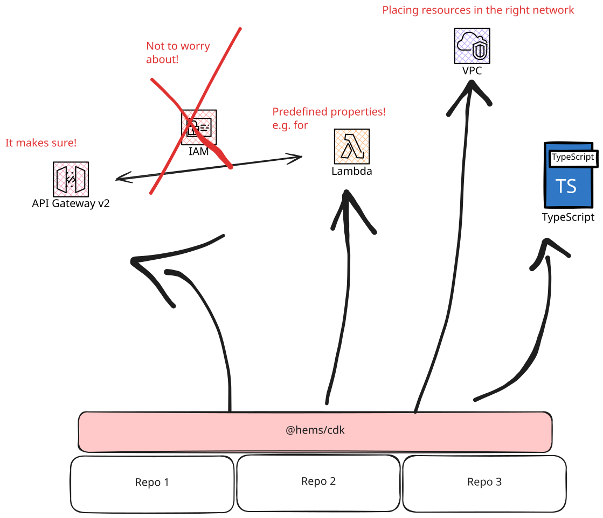
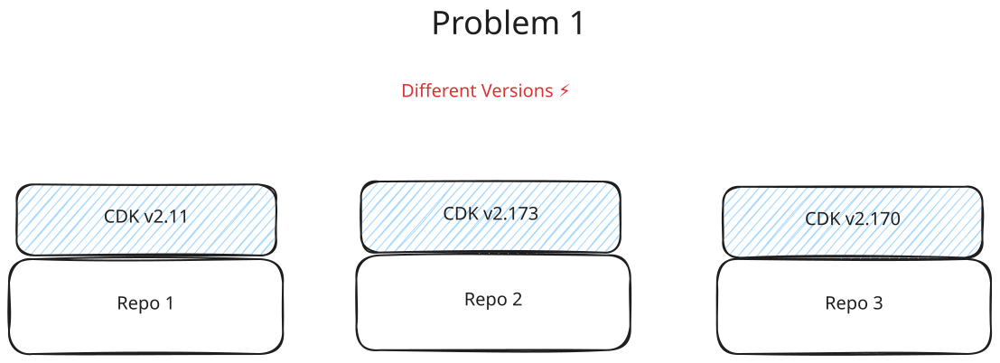
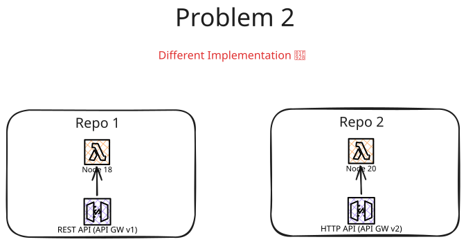
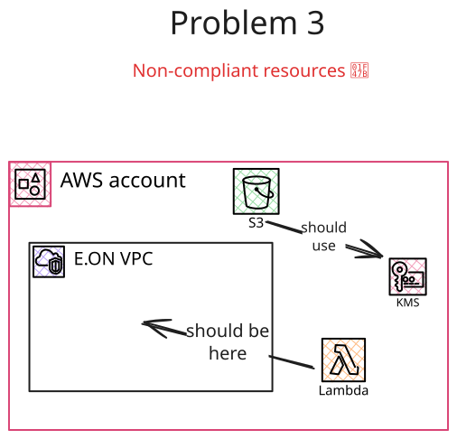

*pawl* (**P**roficient **AW**S **L**ibrary) (pronounce: pɔːl) is a one stop shop that contains best practices of using AWS CDK, AWS Lambda, SAM templates, and any AWS related library for HEMS.
The goal is that it is the only dependency that provides coding primitives to deploy your service successfully. In addition, these libraries are company compliant and contain best practices when dealing with AWS.
Furthermore, it should simplify the infrastructure decision so that the developer can focus on logic implementation.

## Features

This repository offers

- Standards and Best practices
- Powerful AWS CDK Constructs
- Typesafe Code Building Blocks
- Battery-included Library for your Lambda



## Why do we need such a library?

The following problems will be addressed.

### Avoid different versions

Currently, we have multiple repositories. A problem could be to that we have different version for each repositories.



AWS CDK wants you to install it globally, which may leads to different versions on your machine. Furthermore, the repositories could 

### Different implementation

Another problem is the different ways to implement AWS Resources. For example, in one repository the older API GW is used whereas the another repo uses the newer version or different NodeJS versions are used.



### No Compliant AWS Resources

From compliance perspective, it could be that the AWS resource has to fullfil compliance such as
be in the right VPC or having encryption enabled.
The coding blocks should make it easy to choose the right networking or even to abstract these.



## Pre-Requisite

- Docker

### `.npmrc`

Every library of `@pawl` is coming from the Gitlab registry. Make sure you add

```sh
@pawl:registry=https://git.eon-cds.de/api/v4/projects/24549/packages/npm/
//git.eon-cds.de/api/v4/projects/24549/packages/npm/:_authToken="glpat-<your_token>"
```

It most likely that you have a token from `@eon-home`. You can use that.
