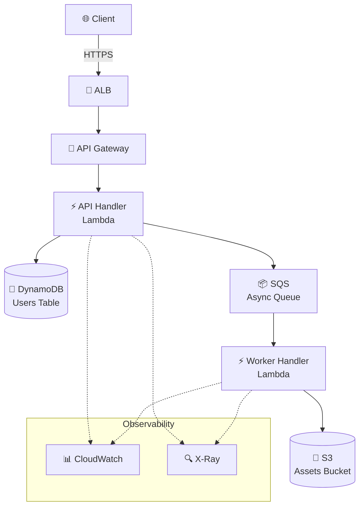

# Infrastructure Plan Generator

When generating an AWS infrastructure plan, follow this workflow:

## Step 1: Analyze the Codebase

The codebase scan is already provided in the prompt. Use it directly — do NOT run additional shell commands (find, cat, ls, grep) to re-scan files.

From the scan, identify:
- **Runtime** — Node.js, Python, Go, Java, containerized
- **Framework** — Express, Fastify, Next.js, Flask, Django, etc.
- **Dependencies** — Database, cache, queue, storage, auth
- **Deployment hints** — Dockerfile, Procfile, serverless.yml, CDK stacks

## Step 2: Generate the Plan

Write the plan to `.pawl/plan.md` using this structure:

```markdown
# Infrastructure Plan

## Application Summary
- **Runtime**: Node.js 22 / Python 3.12 / etc.
- **Framework**: Express / Next.js / Flask / etc.
- **Type**: REST API / GraphQL / Web App / Worker / etc.

## Proposed Architecture

### Services
| Service | AWS Resource | Justification |
|---------|-------------|---------------|
| API | API Gateway + Lambda | Serverless, auto-scaling |
| Database | DynamoDB / RDS | Based on access patterns |
| Cache | ElastiCache / DAX | If needed |
| Queue | SQS | For async processing |

### Network
- VPC: Yes/No (required if RDS, ElastiCache, private Lambda)
- Subnets: Public + Private (if VPC)
- NAT Gateway: Yes/No

### Security
- IAM: Least-privilege per service
- WAF: Yes/No for API Gateway
- Secrets: AWS Secrets Manager / Parameter Store

### Observability
- CloudWatch Alarms: Error rate, latency, throttle
- X-Ray Tracing: Enabled for all Lambdas
- Structured Logging: JSON via Lambda Powertools

### Architecture Diagram

Include a Mermaid `graph TD` diagram showing all AWS services, data flow, and connections. Use AWS-style node labels and group by VPC/subnet when applicable.

Example:


**Diagram rules:**
- Use `graph TD` (top-down) layout
- Include all services from the proposed architecture
- Group related services with `subgraph` (e.g., Observability, VPC)
- Show data flow direction with `-->` (sync) and `-.->` (async/monitoring)
- Use emoji for AWS service visual identification
- Label nodes with service name AND the actual resource (e.g., table name, queue name)
- Keep it readable — max 15-20 nodes

## Deployment Strategy
- **Environment**: dev → staging → prod
- **CDK**: Stack per environment or single stack with context
- **CI/CD**: GitHub Actions / manual

## File Plan
| File | Purpose |
|------|---------|
| `infra/stacks/api-stack.ts` | API Gateway + Lambda |
| `infra/stacks/data-stack.ts` | DynamoDB / RDS |
| `infra/src/handlers/*.ts` | Lambda handlers |
```

## Step 3: Present for Review

Display the plan and ask the user to review. Suggest adjustments:
- "Does this architecture match your needs?"
- "Should we use RDS instead of DynamoDB?"
- "Do you need a VPC for this workload?"

**Wait for approval before proceeding to code generation.**

## Rules

1. Always analyze the actual codebase — don't guess
2. Use `@pawl/cdk` constructs exclusively in the proposed architecture
3. Use `@pawl/lambda` handlers for all Lambda functions
4. Include observability (alarms, tracing, logging) in every plan
5. Prefer serverless over provisioned resources unless justified
6. Always propose least-privilege IAM
7. Store the plan at `.pawl/plan.md` for reference during code generation
8. Include a Mermaid architecture diagram in every plan
